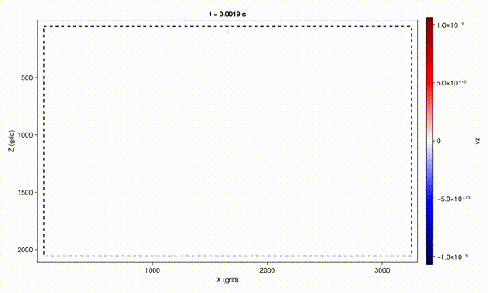
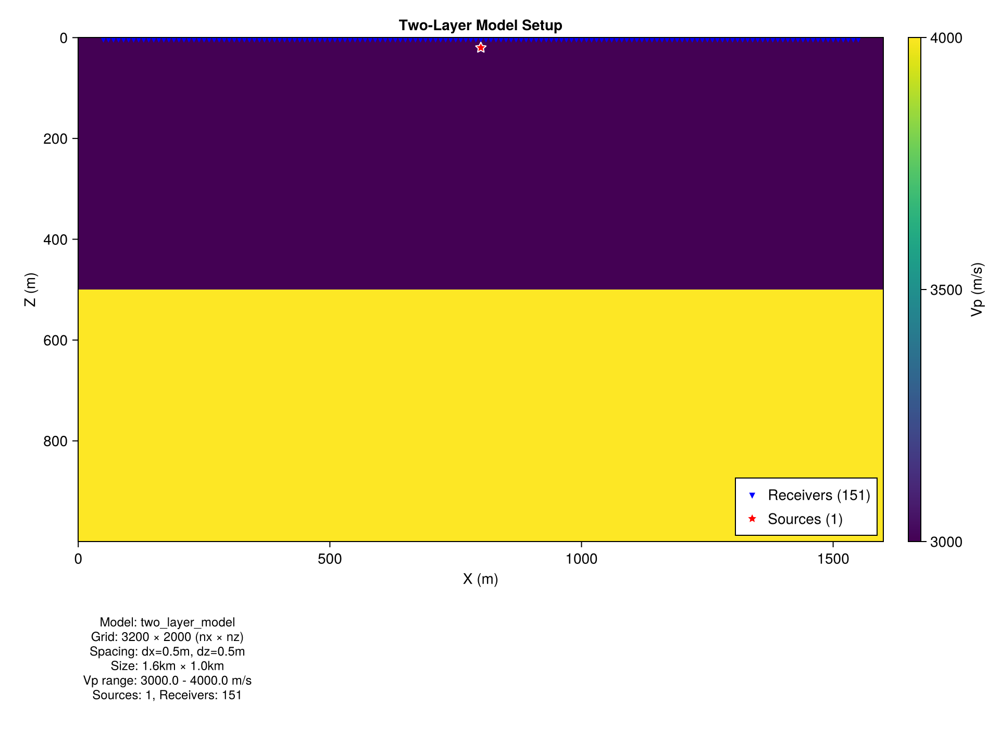
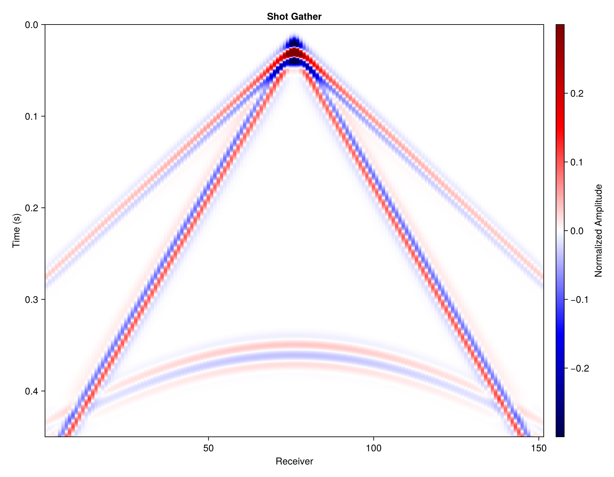
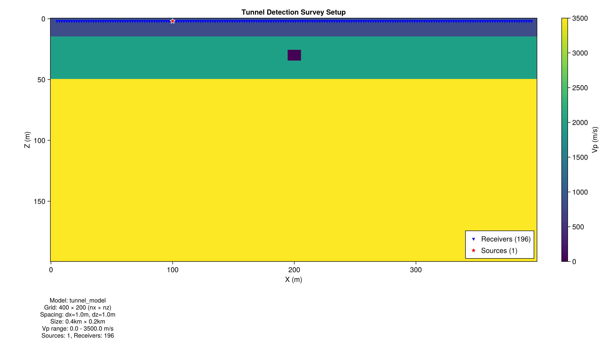
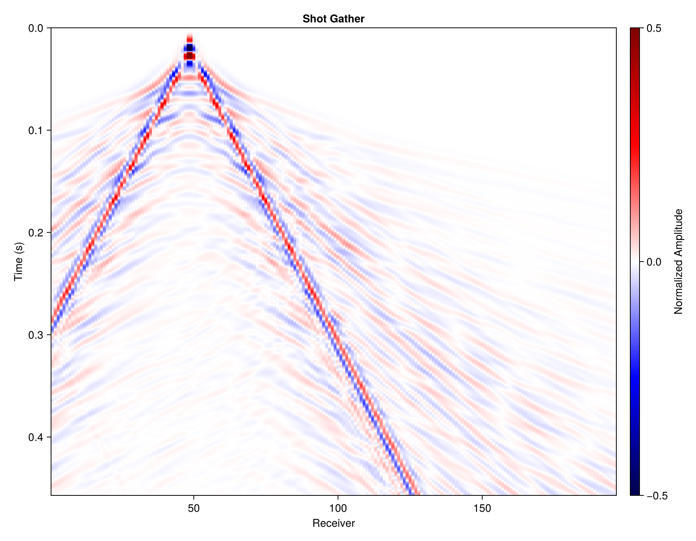
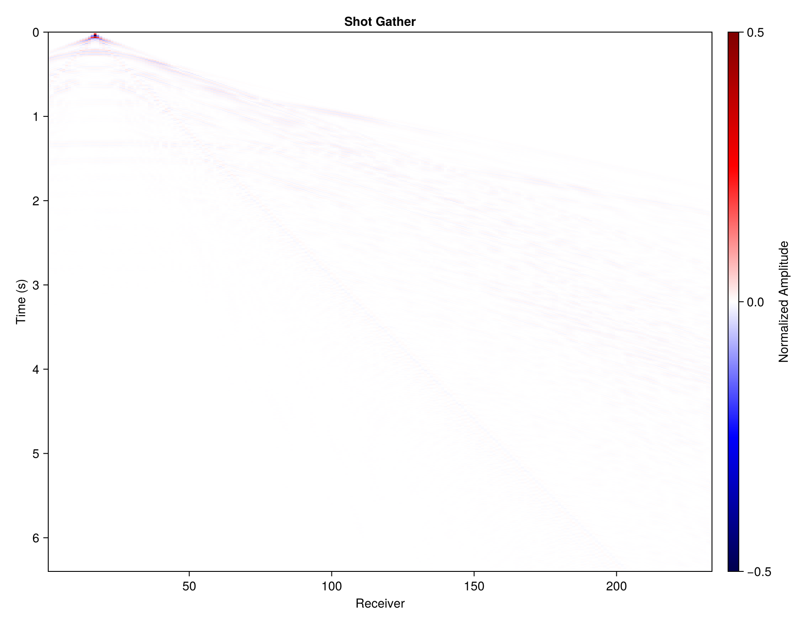
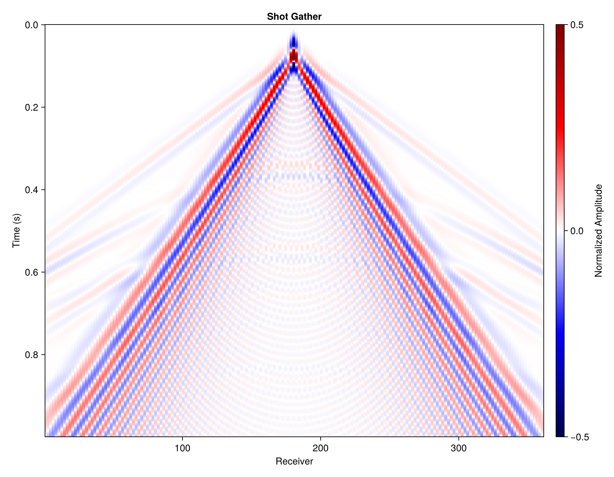
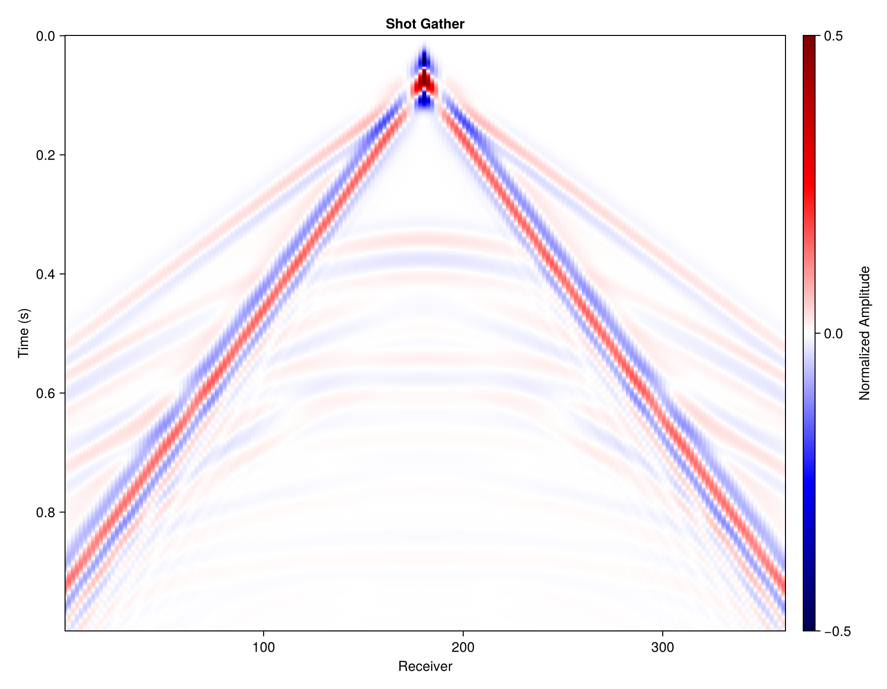

# ElasticWave2D.jl

**中文** | [🇺🇸 English](README.md)

<p align="center">
  <b>基于 Julia 的 GPU 加速二维弹性波模拟</b><br>
  <i>在你的笔记本上运行地震正演</i>
</p>

<p align="center">
  
</p>

## 为什么做这个？

**ElasticWave2D.jl** 是一个纯 Julia 的二维弹性波模拟工具：

- ✅ **一行安装** —— 纯 Julia，无需编译
- ✅ **支持 GPU** —— GTX 1060、RTX 3060 等消费级显卡
- ✅ **CPU 多线程** —— `julia -t auto` 自动并行
- ✅ **代码清晰** —— 便于学习和修改
- ✅ **边界条件** —— HABC、镜像法、真空层

## 特性

| 特性 | 说明 |
|------|------|
| **GPU 加速** | 基于 CUDA.jl，比 CPU 快 10-50 倍 |
| **CPU 多线程** | `julia -t auto` 自动并行 |
| **交错网格有限差分** | 2-10 阶精度 (Virieux 1986) |
| **HABC 边界** | Higdon 吸收边界 (Ren & Liu 2014) |
| **镜像法** | 自由表面边界条件 (Robertsson 1996) |
| **真空层** | 支持地形起伏、隧道、空腔 (Zeng et al. 2012) |
| **视频录制** | 波场快照导出 MP4/GIF |
| **多种格式** | JLD2、二进制、SEG-Y（计划中） |

## 安装

```julia
using Pkg
Pkg.add(url="https://github.com/Wuheng10086/ElasticWave2D.jl")
```

**环境要求**：Julia 1.9+，GPU 可选（自动检测 CUDA）。

## 快速开始

```julia
using ElasticWave2D.API

# 创建一个简单的双层模型
nx, nz = 200, 100
dx = 10.0f0

vp = fill(2000.0f0, nz, nx)
vs = fill(1200.0f0, nz, nx)
rho = fill(2000.0f0, nz, nx)
vp[50:end, :] .= 3500.0f0  # 下层速度更快

model = VelocityModel(vp, vs, rho, dx, dx)

# 运行模拟
result = simulate(
    model,
    SourceConfig(1000.0, 20.0; f0=20.0),           # 震源位于 (1000m, 20m深度)
    line_receivers(100.0, 1900.0, 181; z=10.0);    # 181 个检波器
    config = SimConfig(nt=1000, boundary=Vacuum(10))
)

# 获取结果
println("道集大小: ", size(result.gather))
plot_gather(result)
```

## 示例

### 🎬 弹性波演示
双层介质中的波传播，带视频输出。

```julia
using ElasticWave2D.API

model = VelocityModel(vp, vs, rho, 10.0f0, 10.0f0)

result = simulate(
    model,
    SourceConfig(2000.0, 50.0, Ricker(15.0)),
    line_receivers(100, 3900, 191);
    config = SimConfig(nt=3000, boundary=FreeSurface()),
    video = Video(fields=[:vz], interval=20, fps=30)
)
```

<p align="center">
  
  
</p>

---

### 🏗️ 隧道探测
用地震绕射波探测地下空腔，真空层处理自由表面和隧道。

```julia
# 创建带隧道的模型（ρ=0 表示空腔）
rho[40:45, 95:105] .= 0.0f0  # 隧道空腔

result = simulate(
    model,
    SourceConfig(500.0, 10.0; f0=50.0),
    line_receivers(100, 900, 81);
    config = SimConfig(nt=2000, boundary=Vacuum(10))
)
```

<p align="center">
  
  
</p>

**观察要点**：隧道边缘的绕射波，隧道后方的阴影区。

---

### 🛢️ 油气勘探
背斜构造成像，经典的油气圈闭。

<p align="center">
  
  
</p>

**观察要点**：背斜顶部的反射"上拉"，多层反射波。

---

### 🔬 边界条件对比

| 方法 | 面波 | 适用场景 |
|------|------|----------|
| `Absorbing()` | ❌ | 仅体波研究 |
| `FreeSurface()` | ✅ | 精确的平坦自由表面（镜像法） |
| `Vacuum(n)` | ✅ | 地形起伏、空腔（推荐） |

```julia
# 对比不同边界条件
for boundary in [Absorbing(), FreeSurface(), Vacuum(10)]
    result = simulate(model, source, receivers;
        config = SimConfig(nt=2000, boundary=boundary))
end
```

<p align="center">
  
  
</p>
<p align="center">
  <i>左：镜像法 | 右：真空层公式 —— 结果几乎一致</i>
</p>

## API 参考

### 核心类型

```julia
# 子波
Ricker(f0)                    # 主频 f0 的 Ricker 子波
Ricker(f0, delay)             # 带延迟
CustomWavelet(data)           # 自定义子波

# 震源
SourceConfig(x, z; f0=15.0)                    # 简单写法
SourceConfig(x, z, Ricker(15.0), ForceZ)       # 完整写法
# 震源类型: Explosion, ForceX, ForceZ, StressTxx, StressTzz, StressTxz

# 检波器
line_receivers(x0, x1, n; z=0.0)              # 一排检波器
ReceiverConfig(x_vec, z_vec)                   # 自定义位置
ReceiverConfig(x_vec, z_vec, Vx)              # 记录 Vx

# 边界
FreeSurface()      # 镜像法（平自由表面）
Absorbing()        # 四边 HABC
Vacuum(n)          # 顶部 n 层真空（推荐）

# 配置
SimConfig(
    nt = 3000,           # 时间步数
    dt = nothing,        # 自动算（CFL）
    cfl = 0.4,           # CFL 数
    fd_order = 8,        # 差分精度 (2,4,6,8,10)
    boundary = Vacuum(10),
    output_dir = "outputs"
)

# 视频
Video(
    fields = [:vz],      # 记录哪些场
    interval = 50,       # 每 N 步存一帧
    fps = 20,
    format = :mp4        # :mp4 或 :gif
)
```

### 主要函数

```julia
# 单炮模拟
result = simulate(model, source, receivers; config, video=nothing)

# 批量多炮
using ElasticWave2D
sim = BatchSimulator(model, rec_x, rec_z; nt=3000, f0=15.0)
gathers = simulate_shots!(sim, src_x_vec, src_z_vec)

# 结果存取
save_result(result, "shot_001.jld2")
result = load_result("shot_001.jld2")

# 绑图（需要 Plots.jl）
plot_gather(result)
plot_trace(result, 50)
```

### 结果结构

```julia
result.gather      # [nt × n_receivers] 地震记录
result.dt          # 时间步长
result.nt          # 时间步数
result.snapshots   # 波场快照（需启用视频录制）
```

## 性能

**GPU**（RTX 3060, 12GB）：

| 网格 | 时间步 | 耗时 |
|------|--------|------|
| 400×200 | 3000 | ~8 秒 |
| 800×400 | 5000 | ~45 秒 |
| 1200×600 | 8000 | ~3 分钟 |

**CPU**（8核，`-t auto`）：约为 GPU 的 1/10 ~ 1/20 速度。

### 多炮性能

```julia
using ElasticWave2D
result = benchmark_shots(model, rec_x, rec_z, src_x, src_z; nt=3000, f0=15.0)
# GPU 中等网格约 0.1-0.3 秒/炮
```

## 为什么做这个

作为地球物理专业学生，需要一个轻量的正演工具用于快速实验和学习。SOFI2D、SPECFEM 等软件功能完善，但配置相对复杂。

另外，HABC 边界条件相比 PML 计算效率更高，适合在普通硬件上运行。

基于以上需求开发了 ElasticWave2D.jl。

## 项目结构

```
ElasticWave2D.jl/
├── src/
│   ├── api/                # 高层 API（推荐用这个）
│   ├── compute/            # CPU/GPU 抽象
│   ├── core/               # 基础类型
│   ├── physics/            # 计算核心
│   ├── initialization/     # 初始化
│   ├── solver/             # 时间步进、批量计算
│   ├── io/                 # 读写
│   └── visualization/      # 画图、视频
├── examples/               # 示例
├── test/                   # 测试
└── docs/                   # 文档
```

## 参考文献

1. Virieux, J. (1986). P-SV wave propagation in heterogeneous media: Velocity-stress finite-difference method. *Geophysics*, 51(4), 889-901.

2. Zeng, C., Xia, J., Miller, R. D., & Tsoflias, G. P. (2012). An improved vacuum formulation for 2D finite-difference modeling of Rayleigh waves including surface topography and internal discontinuities. *Geophysics*, 77(1), T1-T9.

3. Ren, Z., & Liu, Y. (2014). A Higdon absorbing boundary condition. *Journal of Geophysics and Engineering*, 11(6), 065007.

## 引用

```bibtex
@software{elasticwave2d,
  author = {Wu Heng},
  title = {ElasticWave2D.jl: GPU-accelerated 2D Elastic Wave Simulation},
  url = {https://github.com/Wuheng10086/ElasticWave2D.jl},
  year = {2025}
}
```

## 贡献

欢迎提交 Issue 和 PR。

## 许可证

MIT License