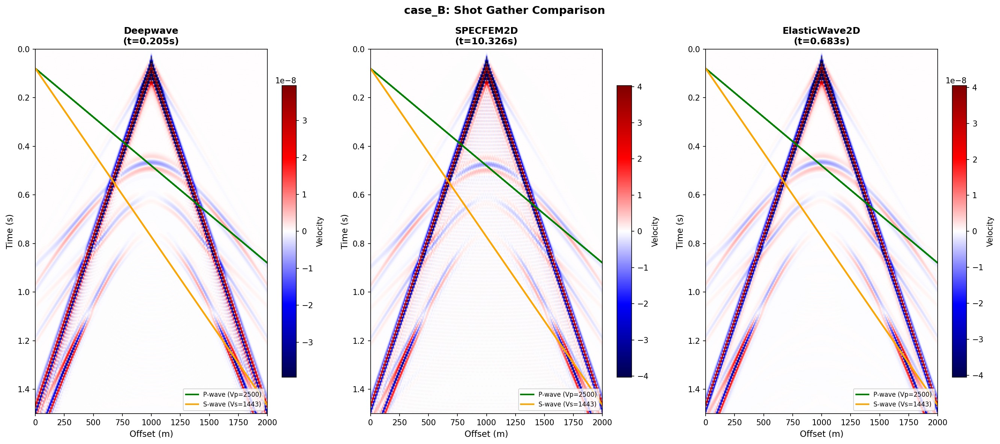
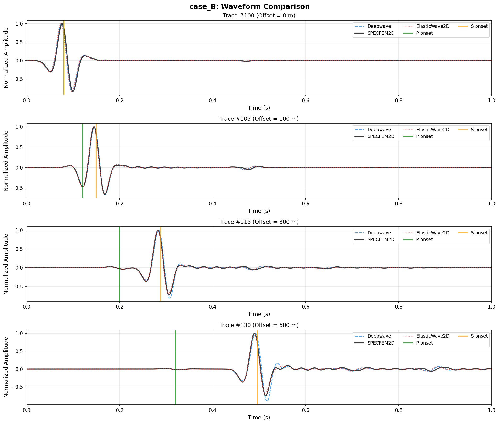
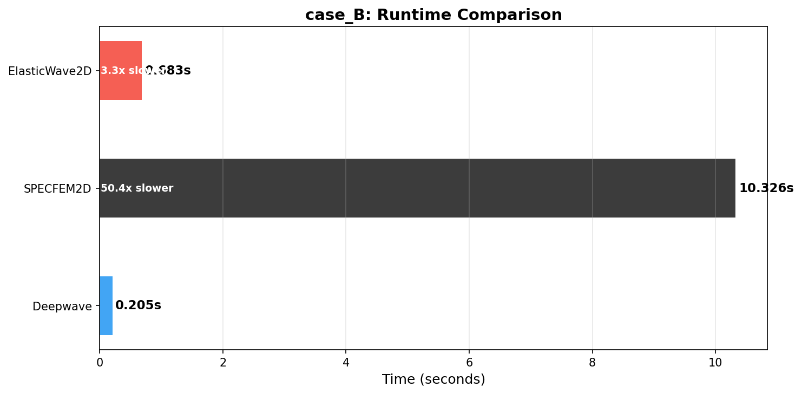
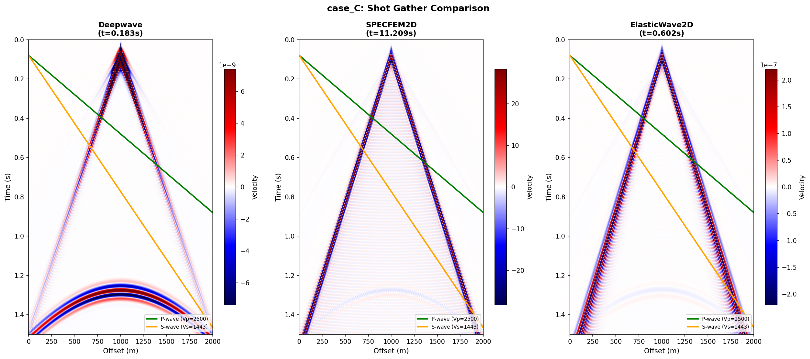
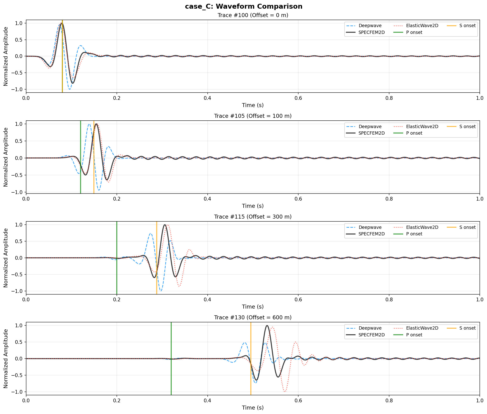
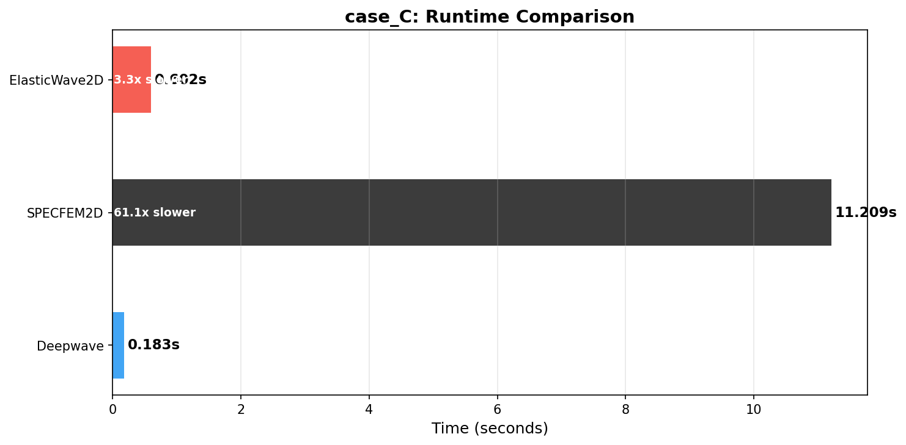

# Elastic Wave 2D Benchmark

Benchmark comparison of three elastic wave forward modeling engines: **SPECFEM2D**, **Deepwave**, and **ElasticWave2D.jl**.

## Software

| Software | Method | Hardware | Notes |
|----------|--------|----------|-------|
| SPECFEM2D | Spectral Element | CPU | High-accuracy reference |
| Deepwave | Finite Difference | GPU | PyTorch-based, differentiable |
| ElasticWave2D.jl | Finite Difference | GPU | Julia/CUDA implementation |

## Test Cases

### Case A: Two-layer Model + Force Source + Absorbing Boundaries

**Purpose**: Test interface reflections without free-surface effects.

- Two-layer velocity model (Vp: 2500/4000 m/s)
- Source at 1000m depth (away from boundaries)
- Receivers at source depth along horizontal line
- All four boundaries absorbing (no free surface, no surface waves)
- Vertical force source → generates P and SV waves

  

  

  

---

### Case B: Two-layer Model + Force Source + Free Surface

**Purpose**: Complete seismic survey scenario with surface waves.

- Same two-layer model as Case A
- **Free surface at top** → generates Rayleigh waves
- Source and receivers near surface (10m depth)
- Other three boundaries absorbing

  

  

  

## Configuration

All parameters are defined in `config.py`:

- Grid spacing: 10m
- Time step: 1ms
- Ricker wavelet: f0 = 15Hz, t0 = 1.2/f0
- PML/HABC width: 50 grid points